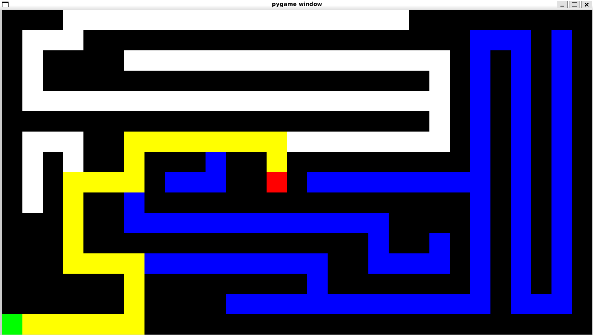
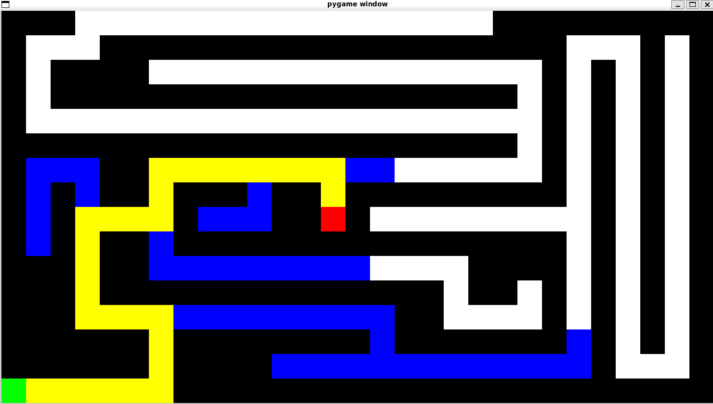
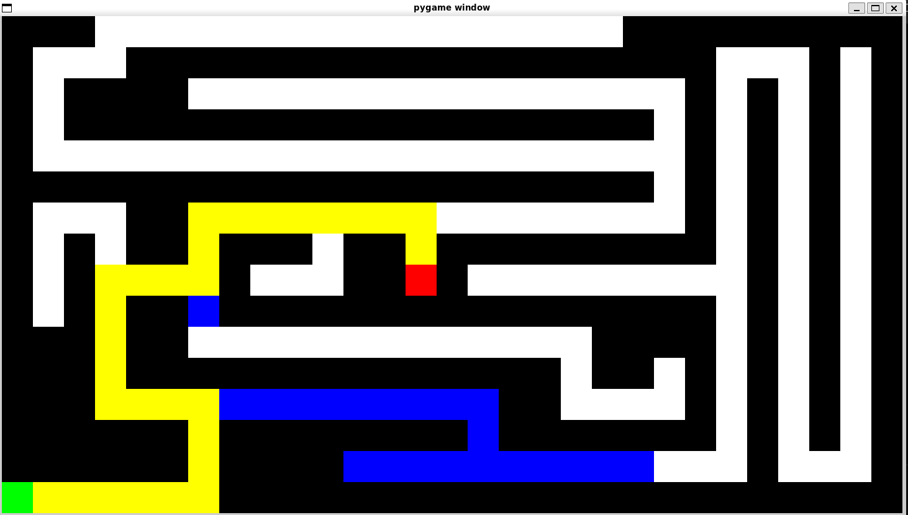

# Maze Solver in Python

For more info refer to word document attatched

# Usage

Before running the program, make sure you have pygame installed

```bash
pip install pygame
```

For Windows

```bash
python maze.py [mazefile].txt [algorithm] [optional:mode] [optional:scaling]
```

For Unix base os

```bash
python3.12 maze.py [mazefile].txt [algorithm] [optional:mode] [optional:scaling]
```

- [mazefile].txt represents the maze to be used
- [algorithm] is the used to specify the algorithm to be used. The available algorithms are DFS, BFS, GBFS.
- DFS - Depth First Search
- BFS - Breadth First Search
- GBFS - Greedy Best First Search
- [mode] = manual or normal, by default normal specifies the way to run the program. In manual mode, press any key to progress through the algorithm
- [scaling] is a number that determines the size of each cell

Example

```bash
python3.12 maze.py maze1.txt bfs manual
```

For more info refer to the word document in the repo

## Depth First Search



## Breadth First Search



## Greedy Best First Search


