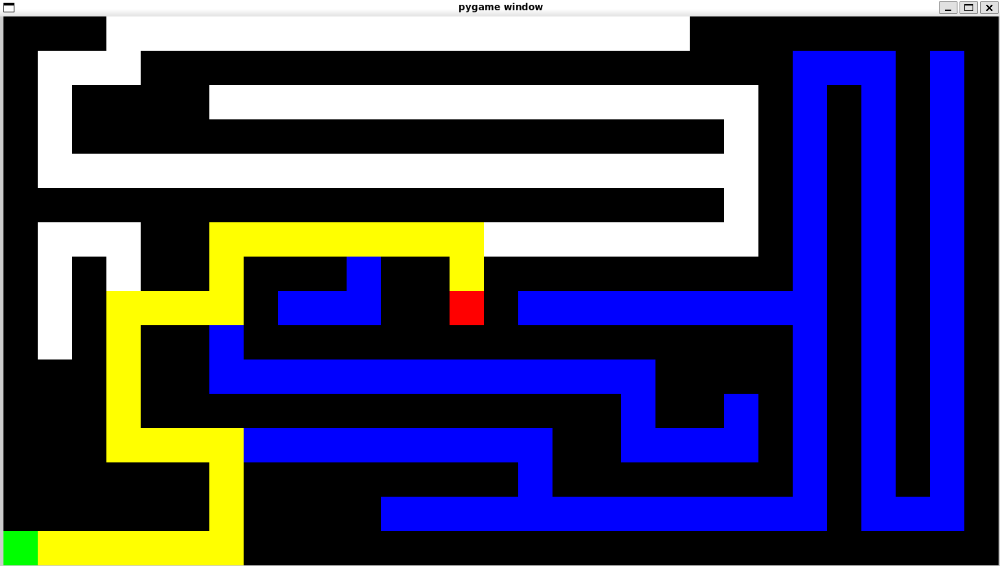

# Maze Solver in Python

For more info refer to word document attatched

### Usage: python maze.py [maze_file].txt algorithm mode

Currently supported algorithms are BFS, DFS.
Mode specifies whether you want to visualize interactiviely or just want the solution.
mode = normal => just the solution.
mode = manual => interactively step through the algorithm

## Depth First Search

## Breadth First Search

